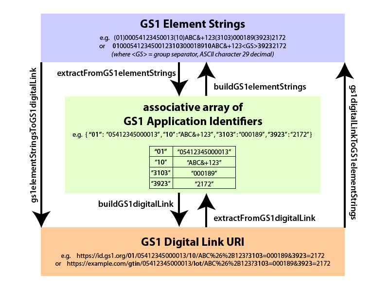

# GS1DigitalLinkToolkit.js
This is a JavaScript toolkit for translating between GS1 element strings and GS1 Digital Link URIs


* [Introduction](#introduction)
* [Overview](#overview)
* [Demo](#demo)
* [Installation](#installation)
* [Basic Usage](#basic-usage)
* [Additional Methods](#additional-methods)
* [Data Resources](#data-resources)
* [Contributors](#contributors)
* [Disclaimer](#disclaimer)
* [Licence](#licence)

## Introduction

The GS1 identification system is widely used worldwide within product barcodes, as well as within barcodes for shipments, assets, locations, etc.

Further information about GS1 can be found at https://www.gs1.org

Details about the GS1 identification system and GS1 Application Identifiers can be found in the GS1 General Specifications at https://www.gs1.org/docs/barcodes/GS1_General_Specifications.pdf and a searchable list of GS1 Application Identifiers is at https://www.gs1.org/standards/barcodes/application-identifiers?lang=en 

GS1 Digital Link is a new Web URI syntax for expressing GS1 Application Identifiers and their values in a Web-friendly format, to make it easier to connect identifiers of products, shipments, locations, assets etc. to related online information and services on the Web via simple Web redirects using Web resolver infrastructure.

The GS1 Digital Link syntax is defined in https://www.gs1.org/standards/Digital-Link/1-0

A demonstration tool is available at https://id.gs1.org/uritool although it does not currently use this toolkit

See also https://github.com/gs1/digital-link.js for a related toolkit for constructing and validating GS1 Digital Link URIs

## Overview

This toolkit provides six translation methods, as indicated in the overview diagram below



## Demo

A simple interactive demonstration Web page is available at 

## Installation

Include the JavaScript file   GS1DigitalLinkToolkit.js   from the source folder /src

e.g.  

```html
<script src="GS1DigitalLinkToolkit.js">
```
  
## Basic Usage

Create a new instance of the GS1DigitalLinkToolkit class as follows:

```js
var gs1dlt = new GS1DigitalLinkToolkit();
```

### Translate GS1 element strings to GS1 Digital Link URI

The method `gs1ElementStringsToGS1DigitalLink(elementStrings, useShortText, uriStem)`
converts a string elementStrings to a GS1 Digital Link URI

The method returns a GS1 Digital Link URI.

elementStrings consists of a single string representing a concatenation of one or more GS1 element strings, either:
- in human-readable format, in which each GS1 Application Identifier is enclosed in round brackets,
  e.g. "(3103)000189(01)05412345000013(3923)2172(10)ABC&+123"
  
- without brackets, in which a group separator character (ASCII character 29 decimal) is used as a delimiter marking the end of any penultimate data value where the corresponding GS1 Application Identifier is not of defined length.

Set the second parameter, `useShortText=true` if you prefer the GS1 Digital Link URI to use alphabetic mnemonic short names as defined in the GS1 Digital Link standard, e.g. /gtin/

Set the second parameter, `useShortText=false` if you prefer the GS1 Digital Link URI to use all-numeric GS1 application identifiers, e.g. /01/

Set the third parameter, `uriStem` to a valid URI stem if you wish to construct a GS1 Digital Link using a specific domain name

If `uriStem` is set to `null`, `undefined` or empty string (''), a default URI stem of 'https://id.gs1.org' will be used.

```js
var gs1dlt = new GS1DigitalLinkToolkit();

var elementStrings="(3103)000189(01)05412345000013(3923)2172(10)ABC&+123";
try {
	var gs1DigitalLinkURI = gs1dlt.gs1ElementStringsToGS1DigitalLink(elementStrings, true, 'http://example.org');
	console.log("gs1DigitalLinkURI='"+gs1DigitalLinkURI+"'"); 
	//  gs1DigitalLinkURI='http://example.org/gtin/05412345000013/lot/ABC?3103=000189&3923=2172'
	
} catch(err) {
	console.log(err);
}	
```

```js
var gs1dlt = new GS1DigitalLinkToolkit();

var elementStringsNoBrackets="3103000189010541234500001339232172"+gs1dlt.groupSeparator+"10ABC&+123";
try {
	var gs1DigitalLinkURI = gs1dlt.gs1ElementStringsToGS1DigitalLink(elementStringsNoBrackets, false, null);
	console.log("gs1DigitalLinkURI='"+gs1DigitalLinkURI+"'"); 
	//  gs1DigitalLinkURI='https://id.gs1.org/01/05412345000013/10/ABC%26%2B123?3103=000189&3923=2172'

} catch(err) {
	console.log(err);
}	
```


### Translate GS1 Digital Link URI to GS1 element strings

The method `gs1digitalLinkToGS1elementStrings(gs1DigitalLinkURI,brackets)`
converts a GS1 Digital Link URI to a string representing concatenated GS1 element strings

The first input parameter `gs1DigitalLinkURI` is expected to be a string representation of a valid GS1 Digital Link URI.

This method returns a string value that represents a concatenation of one or more GS1 element strings extracted from the GS1 Digital Link URI that was supplied as input.

Set the second input parameter, `brackets=true` if you require the output element strings expressed in human-readable format, with round brackets around the numeric GS1 Application Identifiers.

Set the second input parameter, `brackets=false` if you do not require human-readable format.  In this situation, a group separator character (ASCII character 29 decimal) will be used as delimiter after the value of any penultimate data element for which the GS1 Application Identifier is not defined to be of fixed length.

```js
var gs1dlt = new GS1DigitalLinkToolkit();

var gs1DigitalLinkURI = "http://example.org/gtin/054123450013/lot/ABC%26%2B123?3103=000189&3923=2172";

try {
	var gs1ElementStrings = gs1dlt.gs1digitalLinkToGS1elementStrings(gs1DigitalLinkURI, true);
	console.log("gs1ElementStrings='"+gs1ElementStrings+"'"); 
	//  gs1ElementStrings='(01)00054123450013(10)ABC&+123(3103)000189(3923)2172'
} catch(err) {
	console.log(err);
}	
```

```js
var gs1dlt = new GS1DigitalLinkToolkit();

var gs1DigitalLinkURI = "http://example.org/gtin/054123450013/lot/ABC%26%2B123?3103=000189&3923=2172";

try {
	var gs1ElementStrings = gs1dlt.gs1digitalLinkToGS1elementStrings(gs1DigitalLinkURI, false);
	console.log("gs1ElementStrings='"+gs1ElementStrings+"'"); 
	//  gs1ElementStrings='0100054123450013310300018910ABC&+12339232172' 
} catch(err) {
	console.log(err);
}	
```

## Additional Methods


### Translate GS1 element strings to Associative Array

The method `extractFromGS1elementStrings(elementStrings)`
converts concatenated GS1 element strings to an associative array of GS1 application identifiers and their values. 

The method returns a JavaScript object containing numeric GS1 Application Identifier keys and their corresponding values, e.g. {"01":"05412345000013","10":"ABC&+123"}

The input parameter `elementStrings` consists of a single string representing a concatenation of one or more GS1 element strings, either:
- in human-readable format, in which each GS1 Application Identifier is enclosed in round brackets,
  e.g. "(3103)000189(01)05412345000013(3923)2172(10)ABC&+123"
  
- without brackets, in which a group separator character (ASCII character 29 decimal) is used as a delimiter marking the end of any penultimate data value where the corresponding GS1 Application Identifier is not of defined length.


```js
var gs1dlt = new GS1DigitalLinkToolkit();

var elementStrings="(3103)000189(01)05412345000013(3923)2172(10)ABC&+123";
try {
	var gs1Array = gs1dlt.extractFromGS1elementStrings(elementStrings);
	console.log("gs1Array="+JSON.stringify(gs1Array)); 
	//  gs1Array={"10":"ABC&+123","3103":"000189","3923":"2172","01":"05412345000013"}
	
} catch(err) {
	console.log(err);
}	
```


### Translate Associative Array to GS1 element strings

The method `buildGS1elementStrings(gs1AIarray,brackets)`
converts an associative array of GS1 application identifiers and their values to concatenated GS1 element strings.

This method returns a string value that represents a concatenation of one or more GS1 element strings extracted from the GS1 Digital Link URI that was supplied as input.

The first input parameter, `gs1AIarray` is a JavaScript object containing numeric GS1 Application Identifier keys and their corresponding values, e.g. {"01":"05412345000013","10":"ABC&+123"}

Set the second input parameter, `brackets=true` if you require the output element strings expressed in human-readable format, with round brackets around the numeric GS1 Application Identifiers.

Set the second input parameter, `brackets=false` if you do not require human-readable format.  In this situation, a group separator character (ASCII character 29 decimal) will be used as delimiter after the value of any penultimate data element for which the GS1 Application Identifier is not defined to be of fixed length.

```js
var gs1dlt = new GS1DigitalLinkToolkit();

var gs1Array={"10":"ABC&+123","3103":"000189","3923":"2172","01":"00054123450013"};

try {
	var gs1ElementStrings = gs1dlt.buildGS1elementStrings(gs1Array,true);
	console.log("gs1ElementStrings="+gs1ElementStrings); 
	//  gs1ElementStrings=(01)00054123450013(10)ABC&+123(3103)000189(3923)2172
	
} catch(err) {
	console.log(err);
}	
```


### Translate Associative Array to GS1 Digital Link URI

The method `buildGS1digitalLink(gs1AIarray,useShortText,uriStem)`
converts an associative array of GS1 application identifiers and their values to a GS1 Digital Link URI.

The method returns a GS1 Digital Link URI.

The first input parameter, `gs1AIarray` is a JavaScript object containing numeric GS1 Application Identifier keys and their corresponding values, e.g. {"01":"05412345000013","10":"ABC&+123"}

Set the second parameter, `useShortText=true` if you prefer the GS1 Digital Link URI to use alphabetic mnemonic short names as defined in the GS1 Digital Link standard, e.g. /gtin/

Set the second parameter, `useShortText=false` if you prefer the GS1 Digital Link URI to use all-numeric GS1 application identifiers, e.g. /01/

Set the third parameter, `uriStem` to a valid URI stem if you wish to construct a GS1 Digital Link using a specific domain name

If `uriStem` is set to `null`, `undefined` or empty string (''), a default URI stem of 'https://id.gs1.org' will be used.

```js
var gs1dlt = new GS1DigitalLinkToolkit();

var gs1Array={"10":"ABC&+123","3103":"000189","3923":"2172","01":"00054123450013"};

try {
	var gs1DigitalLinkURI = gs1dlt.buildGS1digitalLink(gs1Array,true,'https://example.org');
	console.log("gs1DigitalLinkURI="+gs1DigitalLinkURI); 
	//  gs1DigitalLinkURI=https://example.org/gtin/00054123450013/lot/ABC%26%2B123?3103=000189&3923=2172
	
} catch(err) {
	console.log(err);
}	
```


### Translate GS1 Digital Link URI to Associative Array

The method `extractFromGS1digitalLink(gs1DigitalLinkURI)`
converts a GS1 Digital Link URI to an associative array of GS1 application identifiers and their values.

The input parameter `gs1DigitalLinkURI` is expected to be a string representation of a valid GS1 Digital Link URI.

The method returns a JavaScript object containing numeric GS1 Application Identifier keys and their corresponding values, e.g. {"01":"05412345000013","10":"ABC&+123"}

```js
var gs1dlt = new GS1DigitalLinkToolkit();

var gs1DigitalLinkURI = "http://example.org/gtin/054123450013/lot/ABC%26%2B123?3103=000189&3923=2172";
try {
	var gs1Array = gs1dlt.extractFromGS1digitalLink(gs1DigitalLinkURI);
	console.log("gs1Array="+JSON.stringify(gs1Array)); 
	//  gs1Array={"10":"ABC&+123","3103":"000189","3923":"2172","01":"00054123450013"}
	
} catch(err) {
	console.log(err);
}	
```


## Data resources

The toolkit also provides a number of public data resources which may be useful:

### aitable

returns a list of objects containing information about each GS1 Application Identifier, including:
- title (name) e.g. 'Global Trade Item Number (GTIN)'
- label, e.g. 'GTIN'
- shortcode (as may be used in GS1 Digital Link URI syntax), e.g. 'gtin'
- ai (numeric string equivalent), e.g. '01'
- format (as appearing in the GS1 General Specifications), e.g. 'N14'
- type ("I" = primary identification key, 'Q' = key qualifier, 'D' = data attribute)
- fixedLength (true if appearing in table of defined-length AIs, false otherwise)
- checkDigit (integer indicating check digit position, starting at 1 for first digit - or 'L' for last digit)
- qualifiers (ordered list of numeric AIs for hierarchical sequence of qualifiers, e.g. ["22","10","21"] for GTIN
- regex (regular expression that should match valid values)


### aiCheckDigitPosition

returns an associative array that maps a GS1 Application Identifier to the index (1 = the first digit) for the position of the check digit within GS1 Application Identifiers that have check digits
returns 'L' (last) if the check digit is in the last position
e.g. returns 14 for ITIP, AI (8006)

### aiRegex

returns an associative array that maps a GS1 Application Identifier to a regular expression pattern that should match valid values

### aiMaps

returns an object that contains lists of:
- identifiers
- qualifiers
- dataAttributes
- fixedLength
- variableLength

### aiShortCode

`this.aiShortCode = {"10":"lot","21":"ser","22":"cpv","253":"gdti","254":"glnx","255":"gcn","401":"ginc","402":"gsin","414":"gln","415":"payto","8003":"grai","8004":"giai","8006":"itip","8010":"cpid","8011":"cpsn","8017":"gsrnp","8018":"gsrn","8019":"srin","00":"sscc","01":"gtin"}`

### aiQualifiers

returns an ordered list of GS1 Application Identifiers that are considered as qualifiers for a specific numeric GS1 AI primary identifier

`this.aiQualifiers = {"414":["254"],"8006":["22","10","21"],"8010":["8011"],"8017":["8019"],"8018":["8019"],"01":["22","10","21"]}`

### shortCodeToNumeric

returns an associative array that maps the alphabetic short names that can be used in the GS1 Digital Link to their numeric GS1 Application Identifier counterparts
is the inverse mapping of that provided by aiShortCode (see above)

`this.shortCodeToNumeric = {"lot":"10","ser":"21","cpv":"22","gdti":"253","glnx":"254","gcn":"255","ginc":"401","gsin":"402","gln":"414","payto":"415","grai":"8003","giai":"8004","itip":"8006","cpid":"8010","cpsn":"8011","gsrnp":"8017","gsrn":"8018","srin":"8019","sscc":"00","gtin":"01"}`

### twoDigitAIs

returns a list of two-digit GS1 Application Identifiers

### threeDigitAIs

returns a list of three-digit GS1 Application Identifiers

### fourDigitAIs

returns a list of four-digit GS1 Application Identifiers

### groupSeparator

groupSeparator returns ASCII character 29, 		`this.groupSeparator= String.fromCharCode(29);`


## Contributors  
- Mark Harrison mark.harrison@gs1.org

## Disclaimer  

This is still a pre-alpha release of the software, which still requires further testing.
It is provided on an as-is basis, with no warranty expressed or implied.
Neither GS1 nor the contributors accept any liability for its use nor for any damages caused through its use.

## Licence

Apache-2.0 licence

